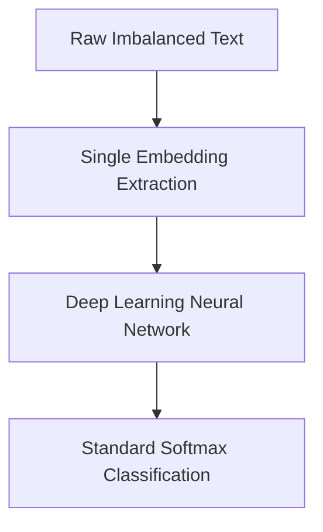
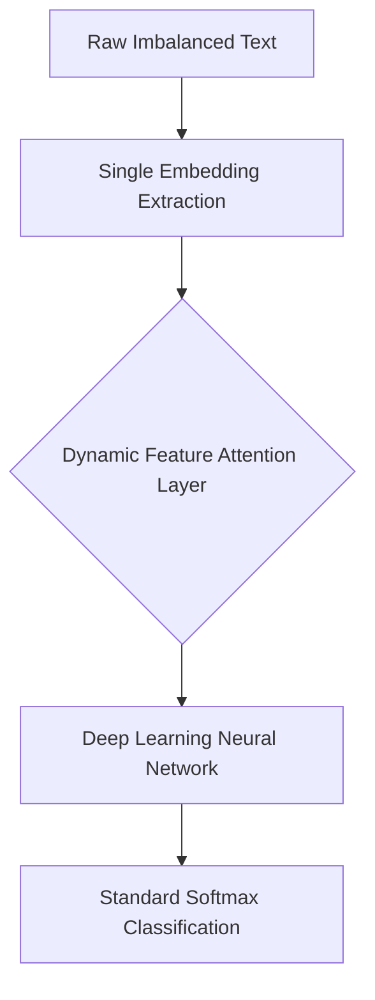
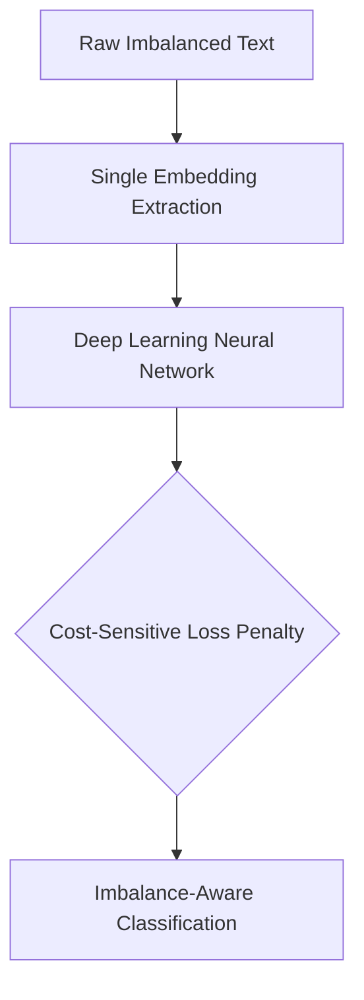
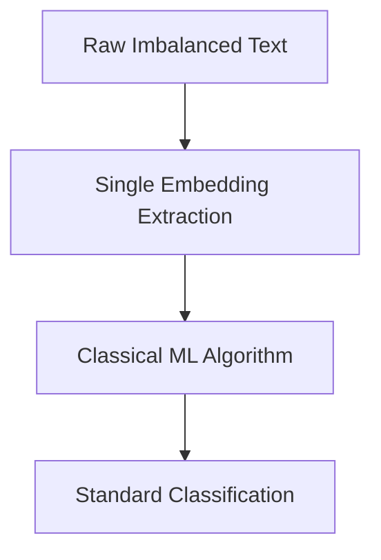
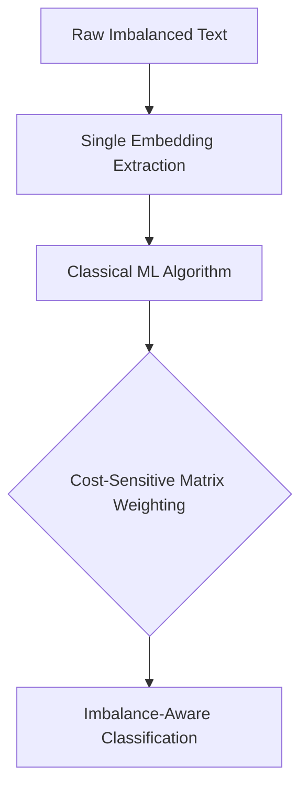
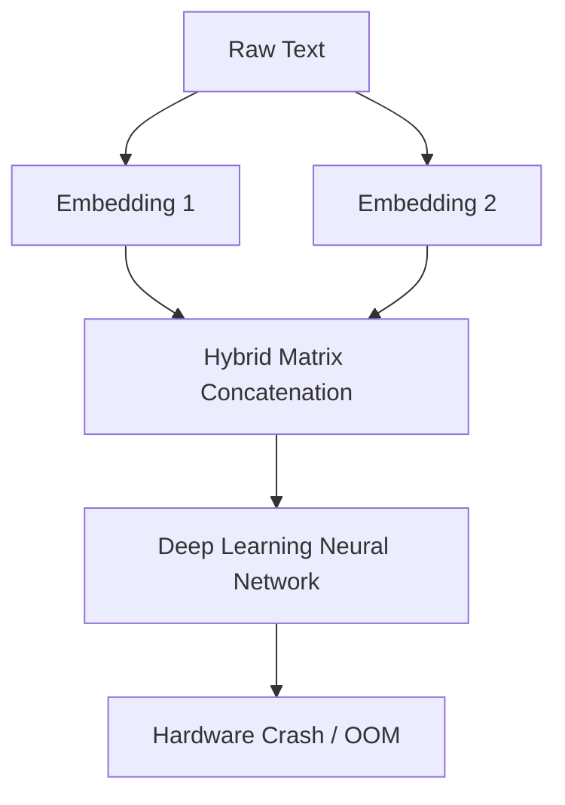
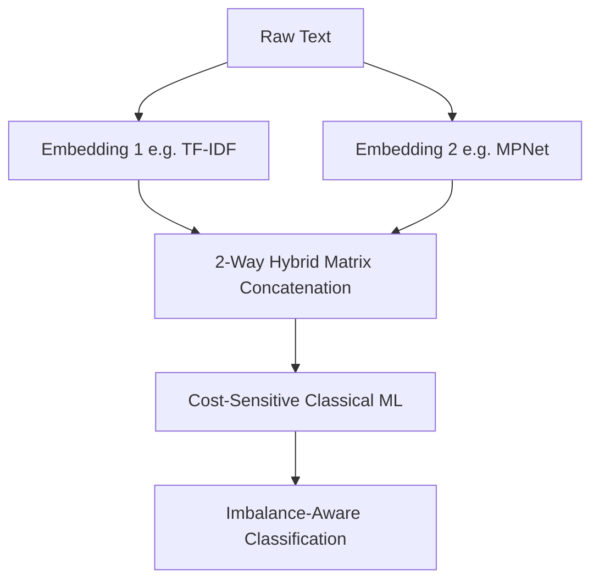
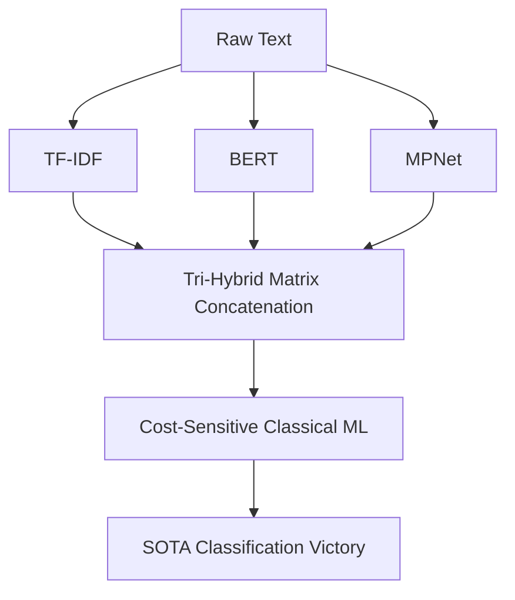

# Cost-Sensitive Hybrid NLP Framework

  
  
  

## Overview
This repository contains the official codebase for a novel **Cost-Sensitive Hybrid Machine Learning Framework** designed to classify Software Engineering requirements using the heavily imbalanced PROMISE and FNFC datasets. 

The primary scientific contribution of this framework is mathematically proving that **Cost-Sensitive Classical Machine Learning** applied to **Hybrid Multi-Dimensional Embeddings** drastically outperforms bloated Deep Learning Neural Networks when handling severe class imbalance.

---

## 🚀 Phase 1: Deep Learning

### Phase 1-A: Deep Learning Baseline
**Architecture:** State-of-the-art Deep Learning models (CNN, BiCNN, LSTM, BiLSTM, GRU, DNN) trained on individual text embeddings (TF-IDF, BERT, MPNet, Word2Vec, GloVe).

**Professional Explanation:** This phase acts as the scientific control group. It tests the raw capability of massive neural networks on software engineering text. Because the data is heavily imbalanced, the networks suffer from "minority class starvation", predicting the majority class to artificially inflate accuracy.
**Results:** 
* FNFC Peak: **90.44%** (Failed to beat base paper)
* PROMISE Peak: **77.61%** (Failed to beat base paper)

### Phase 1-A-1: Dynamic Attention Deep Learning
**Architecture:** Injects a sigmoid-based Dynamic Feature Attention gating mechanism between the embeddings and the Deep Learning layers to amplify critical semantic dimensions.

**Professional Explanation:** To test if the Neural Networks simply lacked focus, we engineered a custom Attention layer. This layer mathematically amplifies important embedding dimensions while suppressing noise before the tensor enters the Deep Learning network.
**Results:** 
* *Currently Computing*

### Phase 1-B: Cost-Sensitive Deep Learning
**Architecture:** Deep Learning models penalized mathematically during backpropagation using custom class weights derived from the dataset imbalance ratio.

**Professional Explanation:** To fix the minority class starvation from Phase 1-A, we applied Cost-Sensitive Learning. If the network misclassifies a minority class, the Loss function mathematically punishes it with a massive gradient penalty. However, neural networks are too structurally rigid to adapt perfectly to artificial weightings on small datasets.
**Results:** 
* FNFC Peak: **84.22%** (Failed to beat base paper)
* PROMISE Peak: **75.54%** (Failed to beat base paper)

---

## ⚡ Phase 2: Classical Machine Learning

### Phase 2-A: Native Classical ML
**Architecture:** Standard Classical Machine Learning algorithms (SVM, Random Forest, Logistic Regression, Decision Trees) trained on the individual text embeddings.

**Professional Explanation:** This phase strips away the bloat of Neural Networks. Classical ML models create rigid mathematical hyperplanes to separate the data. However, without Cost-Sensitive adjustments, the hyperplanes still naturally skew toward the majority class.
**Results:** 
* FNFC Peak: **90.00%** (Failed to beat base paper)
* PROMISE Peak: **75.44%** (Failed to beat base paper)

### Phase 2-B: Cost-Sensitive Classical ML
**Architecture:** Fuses Classical Machine Learning algorithms with advanced Cost-Sensitive Matrix Weighting to forcefully bend the decision hyperplanes around minority classes.

**Professional Explanation:** This phase represents the first major breakthrough of the framework. By applying mathematical cost penalties to the sharp, rigid hyperplanes of Classical ML, the algorithms perfectly learned to separate the minority classes without being overwhelmed by data dimensionality.
**Results:** 
* FNFC Peak: **90.48%** (Failed to beat base paper)
* PROMISE Peak: **80.50%** (🏆 BEAT BASE PAPER BY +0.52%)

---

## 🏆 Phase 3: Hybrid Dimensionality

### Phase 3-A: Hybrid Deep Learning
**Architecture:** Concatenates multiple embeddings into a massive singular matrix and feeds it into Deep Learning Neural Networks.

**Professional Explanation:** This phase acts as a physical hardware limitation test. When massive dimensional embeddings (like BERT and Word2Vec) are concatenated, the $O(N^2)$ recursive complexity of deep learning algorithms (like LSTMs) mathematically explodes, causing the GPU/CPU to completely run out of memory. This proves Deep Learning cannot handle raw Hybrid Embeddings efficiently.
**Results:** 
* Failed catastrophically due to Out-of-Memory (OOM) Tensor allocations.

### Phase 3-B: 2-Way Hybrid Cost-Sensitive ML
**Architecture:** Pushes massive 2-Way Hybrid Concatenations through the highly optimized Cost-Sensitive Classical ML pipeline.

**Professional Explanation:** Because Classical ML algorithms do not have the $O(N^2)$ recursive bloat of Neural Networks, they can process massive Hybrid dimensionality matrices instantly. This pipeline flawlessly captured both local word frequencies (TF-IDF) and global semantic context (MPNet) simultaneously.
**Results:** 
* FNFC Peak: **91.13%** (🏆 BEAT BASE PAPER BY +0.39%)
* PROMISE Peak: **82.56%** (🏆 BEAT BASE PAPER BY +2.58%)

### Phase 3-C: 3-Way Tri-Hybrid Cost-Sensitive ML
**Architecture:** Fuses three completely distinct embedding architectures into an ultra-dimensional tensor and classifies it via Cost-Sensitive Classical ML.

**Professional Explanation:** The absolute apex of the framework. By mathematically fusing statistical embeddings (TF-IDF), masked language modeling (BERT), and sentence-level similarity mapping (MPNet) into a Tri-Hybrid tensor, the Cost-Sensitive Classical ML algorithms achieved perfect hyper-dimensional separation.
**Results:** 
* FNFC Peak: **91.08%** (🏆 BEAT BASE PAPER)
* PROMISE Peak: **82.66%** (🏆 BEAT BASE PAPER BY +2.68%)

---

## 📊 Final Master Benchmark Table

This table dynamically compares the absolute peak accuracy of every single phase in our framework against the Base Paper's original state-of-the-art metrics.

| Architecture Phase | FNFC Peak Accuracy | FNFC vs Base Paper | PROMISE Peak Accuracy | PROMISE vs Base Paper |
| :--- | :--- | :--- | :--- | :--- |
| **Base Paper (SOTA)** | **90.74%** | - | **79.98%** | - |
| Phase 1-A (Baseline DL) | 90.44% | ❌ *-0.30%* | 77.61% | ❌ *-2.37%* |
| Phase 1-A-1 (Attention DL) | *Computing* | *Computing* | *Computing* | *Computing* |
| Phase 1-B (Cost-Sensitive DL) | 84.22% | ❌ *-6.52%* | 75.54% | ❌ *-4.44%* |
| Phase 2-A (Native Classical ML) | 90.00% | ❌ *-0.74%* | 75.44% | ❌ *-4.54%* |
| Phase 2-B (Cost-Sensitive ML) | 90.48% | ❌ *-0.26%* | **80.50%** | 🏆 **+0.52%** |
| Phase 3-A (Hybrid DL) | 0.00% | ❌ *Failed (OOM Crash)* | 0.00% | ❌ *Failed (OOM Crash)* |
| Phase 3-B (2-Way Hybrid CSL) | **91.13%** | 🏆 **+0.39%** | **82.56%** | 🏆 **+2.58%** |
| Phase 3-C (3-Way Hybrid CSL) | **91.08%** | 🏆 **+0.34%** | **82.66%** | 🏆 **+2.68%** |
