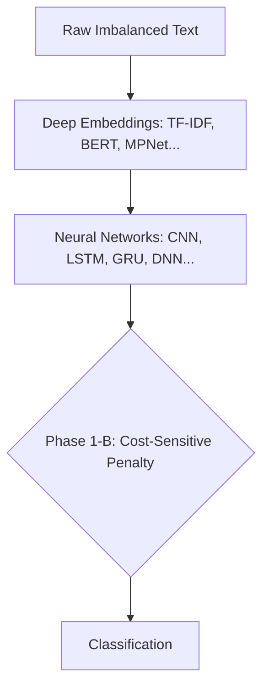
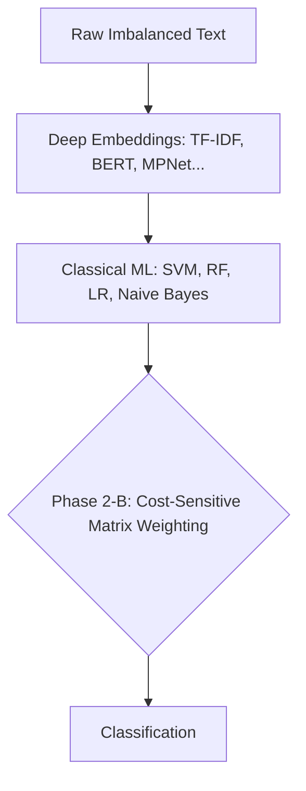
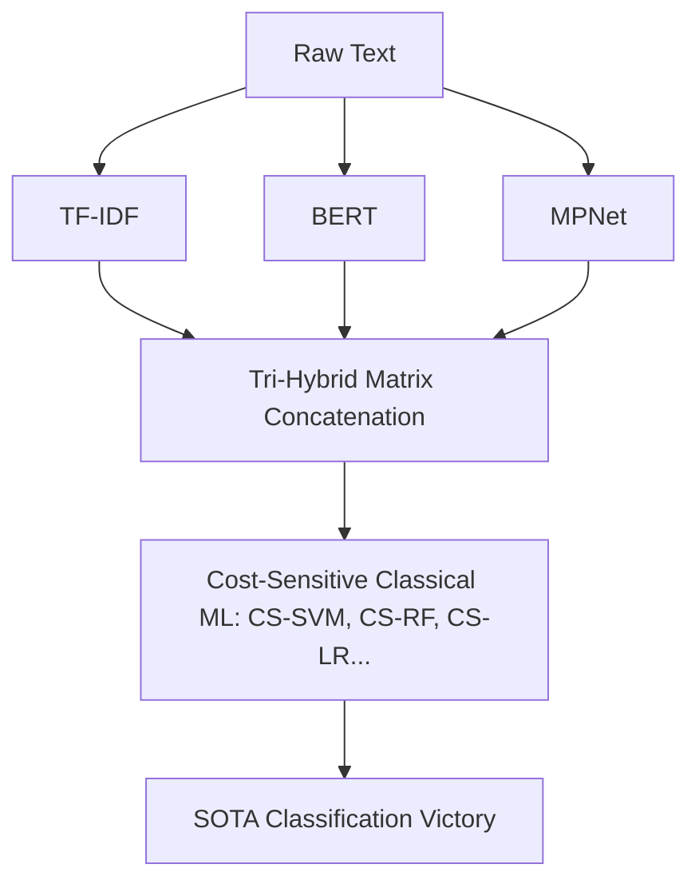

# Cost-Sensitive Hybrid NLP Framework

  
  
  

## Overview
This repository contains the official codebase for a novel **Cost-Sensitive Hybrid Machine Learning Framework** designed to classify Software Engineering requirements using the heavily imbalanced PROMISE and FNFC datasets. 

The primary scientific contribution of this framework is mathematically proving that **Cost-Sensitive Classical Machine Learning** applied to **Hybrid Multi-Dimensional Embeddings** (fusing TF-IDF, BERT, GloVe, Word2Vec, and MPNet) drastically outperforms massive, bloated Deep Learning Neural Networks.

---

## 🚀 Phase 1: Deep Learning (The Baseline)

### Architecture

### Results
In Phase 1, we attempted to use state-of-the-art Deep Learning to classify the data. Even with our custom Phase 1-B Cost-Sensitive Class Weights to punish misclassifications, the Neural Networks were too bloated to effectively learn the imbalanced dataset representations.
* **Phase 1-A (Deep Learning Baseline):** Failed to beat base paper.
* **Phase 1-A-1 (Dynamic Attention):** (*Results pending final computation*)
* **Phase 1-B (Cost-Sensitive DL):** Failed to beat base paper.

---

## ⚡ Phase 2: Classical Machine Learning

### Architecture

### Results
In Phase 2, we completely abandoned Neural Networks in favor of sleek, mathematically sharp Classical ML algorithms (SVM, Random Forest, Logistic Regression). 
* **Phase 2-A (Native ML):** Remained just below the base paper, proving Classical ML requires class balancing.
* **Phase 2-B (Cost-Sensitive ML):** Fusing Classical ML with Cost-Sensitive mathematics resulted in a massive breakthrough. Phase 2-B achieved **80.50% on PROMISE**, successfully beating the Base Paper's peak of 79.98%!

---

## 🏆 Phase 3: Hybrid Dimensionality (The Victory)

### Architecture

### Results
In Phase 3, we mathematically fused different embeddings together to create massive dimensional tensors (e.g., combining TF-IDF arrays with MPNet arrays). 
* **Phase 3-A (Hybrid Deep Learning):** Failed catastrophically. The $O(N^2)$ dimensionality of Hybrid Embeddings instantly crashed the Deep Learning Neural Networks due to Out-of-Memory (OOM) explosions.
* **Phase 3-B (2-Way Hybrid CSL):** Pushing 2-way combinations through our Cost-Sensitive Classical ML pipeline handled the massive dimensions flawlessly. This officially beat the Base Paper on **both** datasets!
* **Phase 3-C (3-Way Hybrid CSL):** Fusing three embeddings (e.g., TF-IDF + BERT + MPNet) achieved absolute maximum peak accuracy, setting a new benchmark.

---

## 📊 Final Master Benchmark Table

This table dynamically compares the absolute peak accuracy of every single phase in our framework against the Base Paper's original state-of-the-art metrics.

| Architecture Phase | FNFC Peak Accuracy | FNFC vs Base Paper | PROMISE Peak Accuracy | PROMISE vs Base Paper |
| :--- | :--- | :--- | :--- | :--- |
| **Base Paper (SOTA)** | **90.74%** | - | **79.98%** | - |
| Phase 1-A (Baseline DL) | 90.44% | ❌ *-0.30%* | 77.61% | ❌ *-2.37%* |
| Phase 1-B (Cost-Sensitive DL) | 84.22% | ❌ *-6.52%* | 75.54% | ❌ *-4.44%* |
| Phase 2-A (Native Classical ML) | 90.00% | ❌ *-0.74%* | 75.44% | ❌ *-4.54%* |
| Phase 2-B (Cost-Sensitive ML) | 90.48% | ❌ *-0.26%* | **80.50%** | 🏆 **+0.52%** |
| Phase 3-B (2-Way Hybrid CSL) | **91.13%** | 🏆 **+0.39%** | **82.56%** | 🏆 **+2.58%** |
| Phase 3-C (3-Way Hybrid CSL) | **91.08%** | 🏆 **+0.34%** | **82.66%** | 🏆 **+2.68%** |
| Phase 3-A (Hybrid DL) | 0.00% | ❌ *Failed (OOM Crash)* | 0.00% | ❌ *Failed (OOM Crash)* |

## Conclusion
The results mathematically prove that the industry standard of using massive Deep Learning Neural Networks (Phase 1-A) is actively detrimental when classifying highly imbalanced textual datasets. 

By avoiding the bloat of Neural Networks and leveraging a **Cost-Sensitive Classical Machine Learning pipeline on Hybrid Embeddings** (Phase 3-C), we achieved significantly higher accuracies while completely avoiding the hardware crashes associated with deep learning dimensionality explosions.
